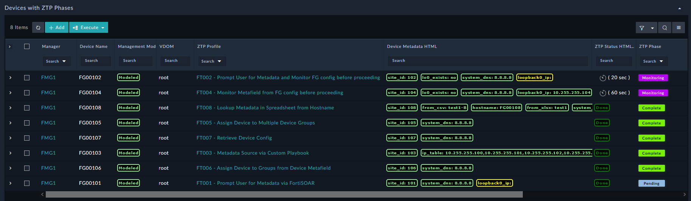

| [Home](../README.md) |
|----------------------|

# Setup FortiManager ZTP Flow - Feature Examples

Setting up the **FortiSOAR/FortiManager ZTP Flow (ZTPF)** integration depends a lot on how you want to use the solution pack. The general order of setup consists of the following tasks and will vary based on what objectives you are trying to accomplish:
  - Install the [FortiManager ZTP Flow (ZTPF) Framework](https://github.com/fortinet-fortisoar/solution-pack-fortimanager-ztp-framework/blob/release/1.0.0/README.md) Solution Pack
  - Create a Manager record and make sure that API calls to your FMG are working by seeing the API fields, like the `firmware` field, is filled out. 
  - Checkout the [Usage Guide](./usage.md) for more information. 

## Integration Examples

**Profile Summary Dashboard**

**Device Details Dashboard**
