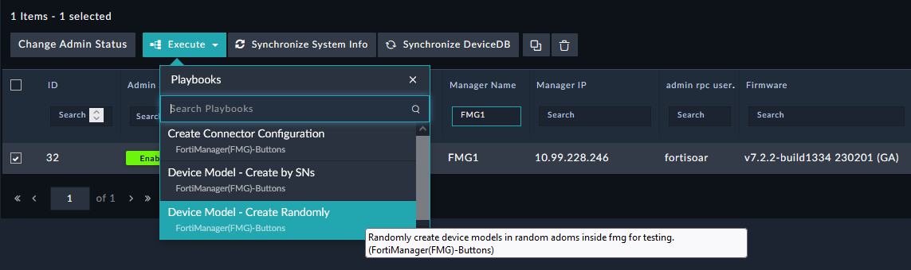
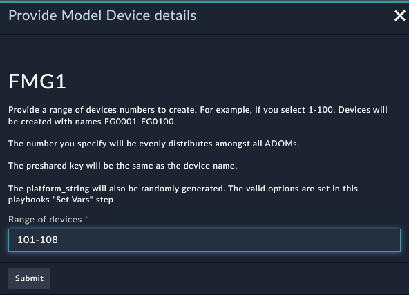
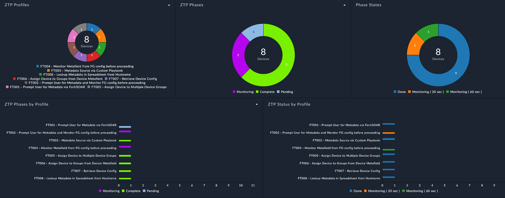
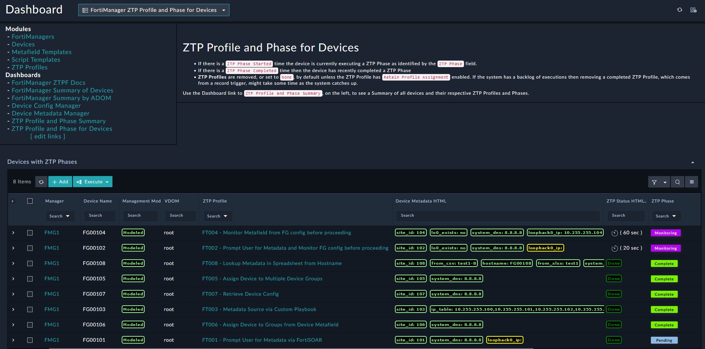

| [Home](../README.md) |
|--------------------------------------------|

# Setup FortiManager ZTP Flow (ZTPF) Frameworkimages/setup/setup

Setting up the FortiSOAR/FortiManager ZTP Flow (ZTPF) integration depends a lot how you want to use the solution pack. The general order of setup consists of the following tasks and will vary based on what objectives you are trying to accomplish:
  - Install the [FortiManager ZTP Flow (ZTPF) Framework](https://github.com/fortinet-fortisoar/solution-pack-fortimanager-ztp-framework) Solution Pack
  - Select your FortiManager Manager record in FortiSOAR.
    - Execute `Device Model - Create Randomly`.
    
    - Enter `101-108` to create `FG00101-FG00108` device modles in FortiManager to test the first 8 ZTP Profiles. 
    

  - Navigate to the Dashbaord `ZTP Profile and Phase for Devices` and inspect the ZTP Profiles in action.
**Profile Summary Dashboard**

**Device Details Dashboard**
